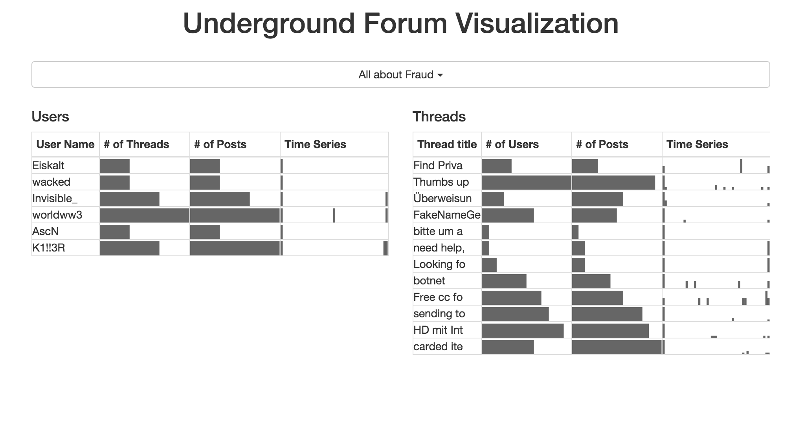

#Visualizing Underground Forums

#Authors: 
Autumn Wu (AntumnWu), Pan Chen (Tebyt), Maeda Hanafi (theTrueCaptian)

#Image of your application

#Description
The goal of Visualizing Underground Forums is to provide an exploratory tool to an investigator interested in such a dataset. We assume that the invstigator has an intention to learn more about the dataset and perhaps even want to pinpoint a certian entity for an investigation and clues. 

We have defined two entities in this application: 1) the forum users and 2) the forum threads/posts. Each entity is associated with questions and our interface allows the investigator to answer those questions. Moreover, this application allows the investigator to instantly see the relationship between these two entities via instantaneous feedback on clicking either one of the entities.

The questions are as follows:
####Questions about the users
#####Who are the users?
#####When are they active? How often are they active (frequency)?

####Questions about the threads/posts
#####What are the threads and in what forum?
#####How many posts and threads are there within each forum?

####There are also questions that are about both of these entities:
#####For a given user, what are his posts over time?
#####For a given thread, who are the users active in that thread?

#Exposed API
The web app has exposed a series of API, which are:

* **/api/forums** return information about forum meta
* **/api/forums/:forumid** return the user and thread data in the specified forum
* **/api/threads** return one sample of thread data
* **/api/posts** return one sample of post data
* **/api/users** return one sample of user data

#Server Set-up

The server uses Express as back-end framework and Mongodb as database.
To make the server run, you should first install Node.js and nodemon and then go into the top directory to run 
	
	npm install
	nodemon

Or you can just upload this folder to a PaaS provider that supports Node.js, and it will take care of running it.

To transfer original data in MySql to Mongodb, you should have Ruby installed, and go to the data_manipulation folder, then:

* Dump the create_table.sql
* Download mongify
* Configue database.config
* Go to data_manipulation folder and run 
		
		mongify process database.config translation_file.rb 

#Link to the Video
https://vimeo.com/149692858
#Link to the Demo
https://viz-ug-forum.herokuapp.com/

#Link to the Final Report.
https://docs.google.com/document/d/1GEJRPKSQn9C6MsqHQsrdRlBwiPdV2nJGv20Clql1yoU/edit?usp=sharing 
#Link to the data (if public)
This data is not public for security purposes.

The derived data is also not shared (due to large size) but can be obtained by running transform.py with python. The data that transform.py will use is in /csv, which contains intermediary, derived data from the original dataset.
